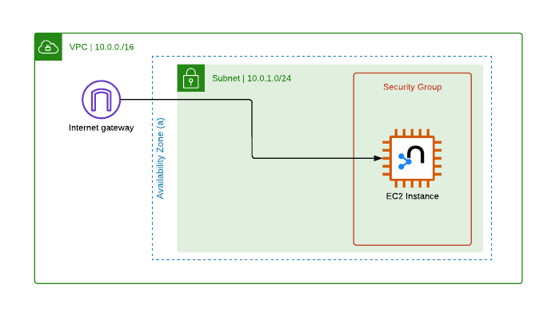

# Neo4j Virus-Host Graph Database

## Accessing Neo4j on web browser

### URL

Find URL under `Neo4j-Graph` [Cloudformation stack outputs](https://us-east-1.console.aws.amazon.com/cloudformation/home?region=us-east-1#/stacks/).

### Credentials

Admin user credentials are stored in [AWS secrets - Neo4j-Graph](https://us-east-1.console.aws.amazon.com/secretsmanager/secret?name=Neo4j-Graph&region=us-east-1). Click "Retrieve secret value" in AWS Console.

<!-- ## Accessing Neo4j on desktop app

### Download

[https://neo4j.com/download/](https://neo4j.com/download/) -->

## PalmDB data source

- Palmprints are subsequences within an Sequence Read Archive (SRA) run
- Each unique palmprint is assigned a unique identifier, i.e. its `palm_id`
- A clustering algorithm identifies selected `palm_id` centroids to a species-like operational taxonomical unit (SOTU). The SOTU identifier is described with its given `palm_id`

## Graph Schema

### Nodes

| Label       | Attributes                                                                                                                                                                                 |
| ----------- | ------------------------------------------------------------------------------------------------------------------------------------------------------------------------------------------ |
| `Palmprint` | `palmId` `sotu` `centroid` `taxPhylum` `taxPhylum` `taxClass` `taxOrder` `taxFamily` `taxGenus` `taxSpecies` `nickname` `palmprint` |

### Edges

| Label              | Attributes |
| ------------------ | ---------- |
| `GLOBAL_ALIGNMENT` | `distance` |

## Cloudformation

- [Reference](https://github.com/neo4j-partners/amazon-cloud-formation-neo4j)

## Neo4j DB management

- There are issues with updating the cloudformation stack since it creates new resources without updating relevant IP config values. For now, to make changes to the neo4j config it's easiest to ssh directly into the instance
- Use "EC2 Instance Connect" to ssh into server instance, this may requiring adding necessary IAM permissions
- Edit config file: `/etc/neo4j/neo4j.conf`
- Download plugins: `/var/lib/neo4j/plugins`
- After making changes, you will need to restart the instance. Some useful commands:
  - Log files: `/var/log/neo4j/`
  - Restart instance: `neo4j stop && neo4j start` or `sudo service neo4j restart`
  - `neo4j status` or `sudo service neo4j status`
  - `curl http://localhost:7474/`

## Future work

### Neo4j community edition

- Role-based security is an Enterprise Edition feature, high-availability clusters are also enterprise only
- In the future, we may want to upgrade to enterprise or rely on infrastructure as code (IaC) + GH actions (CI/CD) to write updates to the database while allowing users read-only access when writing is completed
- A possible workaround is described below:
  - To write to Neo4j, we rely on GH actions and `.cypher` script files
    - 1. Suspend `neo4j-public` user account from access
    - 2. Remove readonly constraint from config file
    - 3. Restart Neo4j instance
    - 4. Use `neo4j-private` to run write cypher queries contained in .cypher script files
  - To read from Neo4j, i.e. after write scripts are completed
    - 1. Add readonly constraint to config file
    - 2. Restart Neo4j instance
    - 2. Activate `neo4j-public` user account
