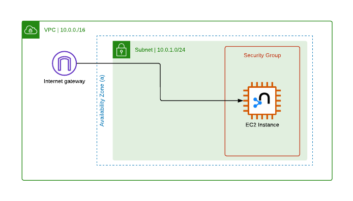

### Neo4j community edition setup

- The free Neo4j community edition we're doesn't support Role-based security or multiple access levels for a single server, i.e. read-only and read-write access.
- To workaround this, we have two seperate instances:
  - `neo4j-graph-worker`: is a high-mem isntance with write access, config settings and additional plugins to support ML and ETL workloads
  - `neo4j-graph-server`: is a t3-med instance with read-only access
- Both instances can synchronize by using backup and restore, either from S3 or EBS multi-attach storage

## Worker machine and ETL Setup

Some optional actions are needed to set up worker instance for running initial ETL.

1. Create CloudFormation stack using [template](./cloudformation/neo4j-community.template.yaml)
   - Existing ssh key: `neo4j`
1. If not already created, create shared EBS volume. Attach to EC2 instance created in CF Stack.
   - Existing EBS volume: `vol-0a228a503a868b12d`
   - Size: 100 GiB, Type: io1 (supports Multi-attach), IOPS: 1600+, Enable Multi-attach
1. Connect to instance using selected ssh key (`neo4j.pem`) or EC2 Instance Connect.
1. Install git and clone repo on machine
   - `sudo yum update -y && sudo yum install git -y && sudo yum install make`
   - `mkdir workspace && cd workspace && git clone https://github.com/serratus-bio/virus-knowledge-graph && cd virus-knowledge-graph`
1. Run `make install` and `make mount-vol` to mount volume to `/mnt/graphdata`
1. Restore data (if backup already on disk) or run full ETL job
   - `make neo4j-restore`
   - OR: set up .env and run `make etl-run`

### Memory management

- Useful debugging commands for mounting volumes
  - Get device name from output: `lsblk`
  - Get filesystem and UID of device: `file -s /dev/$DEVICE_NAME`
  - Get memory usage: `df -h /mnt/$MOUNT_DIR`
  - Unmount device: `sudo umount /dev/$DEVICE_NAME`
  - System logs: `tail dmesg` or `journalctl -f`

### Manual Neo4j DB config management

- Ideally, use cloudformation to make changes to neo4j config. Alternatively, ssh into host, edit config and restart server.
- Useful commands neo4j server managment:
  - Edit config file: `/etc/neo4j/neo4j.conf`
  - Download plugins: `/var/lib/neo4j/plugins`
  - Check status: `neo4j status`, `sudo service neo4j status` or `curl http://localhost:7474/`
  - Rveiw log files: `/var/log/neo4j/`
  - Restart instance: `neo4j stop && neo4j start` or `sudo service neo4j restart`

### Cloudformation

- [Reference](https://github.com/neo4j-partners/amazon-cloud-formation-neo4j)

